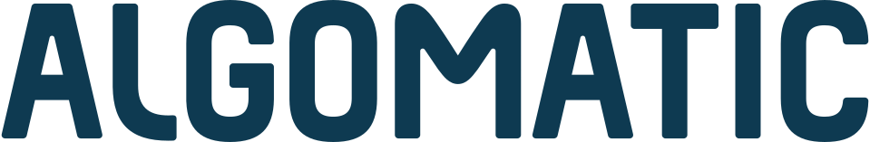

<!-- _class: company-profile -->
<!-- _header: 'プロフィール' -->

**Algomatic 代表取締役CEO**
#### 大野 峻典 / Shunsuke Ono
東京大学工学部卒。東京大学にて深層学習を用いた研究プロジェクトに従事。
2018年、機械学習・深層学習を用いたソリューション開発を行う株式会社Algoageを創業
2020年、DMMグループへM&Aによりジョイン。2023年、大規模言語モデル等生成AI技術を活用した、サービスの開発・提供を行う株式会社Algomaticを創業。

{.ceo-message}

---

<!-- _class: cover -->
<!-- _header: 'Algomatic 会社概要' -->

生成AIサービスに特化したスタートアップ企業。設立2年目で従業員数100名超と急成長。
代表取締役CEOの大野はAI事業開発の専門家。経済メディアPIVOTにて、最先端の生成AI・LLMの知見を解説。

| 項目 | 内容 |
|-|-|
| 会社名 | 株式会社Algomatic |
| 設立日 | 令和5年4月13日 |
| 代表者 | 代表取締役 CEO 大野 峻典 |
| 主事業 | 大規模言語モデル等生成AI技術を活用した、サービスの開発・提供 |
| 事業所 | 東京都中央区日本橋久松町10-6 THE CROSS日本橋人形町 8F |
| 関係会社 | 合同会社DMM.com / 株式会社Algomatic Works |

---

<!-- _class: cover -->

# 目指す世界

Algomaticは、いわゆるスタートアップ的な通説に反する戦い方をします。
1仮説1プロダクトで戦うのではなく、最初から複数領域で同時多発的に事業を立ち上げています。

## Mission  
**AI革命で人々を幸せにする**

## Vision  
**時代を代表する事業群を創る**

---

<!-- _class: cover -->

# Value

Algomaticでは、激動の時代に即応し続けるため、
全社員の行動指針となるValueを定期的に見直し、実践的で価値ある形へと常に進化させ続けます。

- **まずやる、たくさんやる、勝つまでやる**
  私たちは迅速な行動を重視します。変化の時代、行動量こそが武器です。新しいアイデアに躊躇せず挑戦し、失敗を学びに変えながら、成功するまで諦めません。
- **スピード is キング**
  スピードを最高の武器とし、急速に進化する生成AI分野で優位性を築きます。その成果を持続可能な価値へと転換していくことが、私たちの戦略です。
- **100x**
  既存の枠を超え、10%でなく100倍の進化を目指す。常識に囚われない大胆な発想で、「できること」ではなく「すべきこと」から逆算し挑戦します。
- **一兆一円**
  1円へのこだわりが、壮大な目標への道筋を作ります。収益の最大化と費用の最小化、その積み重ねを大切にします。
- **逆境も熱狂**
  仕事を人生を豊かにする喜びとして捉え、どんな状況でも熱狂的に楽しむ。この精神こそが、個人の成長と組織の革新を導く原動力となります。
- **善マインド**
  メンバーの善意を信じ、不要な規則を排し、信頼関係を基盤に。互いに背中を預け合えるチームで、全員の成長を実現します。

---

<!-- _class: cover -->

# 代表メッセージ

## 人類史上2度目の革命を、どう生きるか？

数十万年前、我々の祖先が獲得した「言語」は、人類に高度な思考とコミュニケーション能力をもたらしました。そして今日、機械は「LLM」によって「言語」を理解し、ヒトのような思考力を手にしつつあります。かつて「言語」が人類の飛躍的な進化を実現したように、Algomaticは、AI革命を通じて人々の生活を劇的に豊かにします。
2025年、「いくぞ25」を合言葉に、日本を代表する企業への歩みを加速します。人類二度目の言語革命。その最前線に立ち、AIの力で世界を幸せで満たす。
この挑戦に、共に立ち向かいませんか？

{.ceo-message}

---

<!-- _class: .company-service -->

# 事業実績

## {.company-service__img}
「アポドリ」は、AIエージェントが各企業専属のインサイドセールス担当として、顧客企業のキーパーソンとの商談を獲得・提供するサービスです。

## {.company-service__img}
「リクルタAI」は、採用業務をトータルサポートするAIエージェントです。
運営元：株式会社Algomatic Works

## {.company-service__img}
ゲームの世界観に合わせた高品質な翻訳を、1言語あたり1文字2円〜提供します。

## {.company-service__img}
トップダウンの戦略的AI導入と、現場のニーズに即したユースケース開発を両輪に、AI活用による業務変革（AX）を支援します。

## {.company-service__img}
日常の空き時間や夜遅い時間帯などでも「誰かとちょっと話したいな」と望む時に、気軽に自然でリアルタイムな会話をおしゃべりやチャットで楽しめる新感覚のコミュニケーション体験をお届けします。

## {.company-service__img}
生成AI求人特化型のフリーランスエージェントです。現役生成AI人材が希望の案件探しをサポートします。
運営元：株式会社Algomatic Works

## {.company-service__img}
「ネオデザインAI」は非デザイナーでも簡単に高品質の商用利用可能なクリエイティブが大量に生成できる「画像生成AIエージェント」です。

## {.company-service__img}
『炎上対策ミマモルくん』β版では、Algomatic独自開発の言語解析AIにより、炎上兆候の検知から対策までを自動化し、平常時の防止対策と発生時の被害極小化を実現します。
