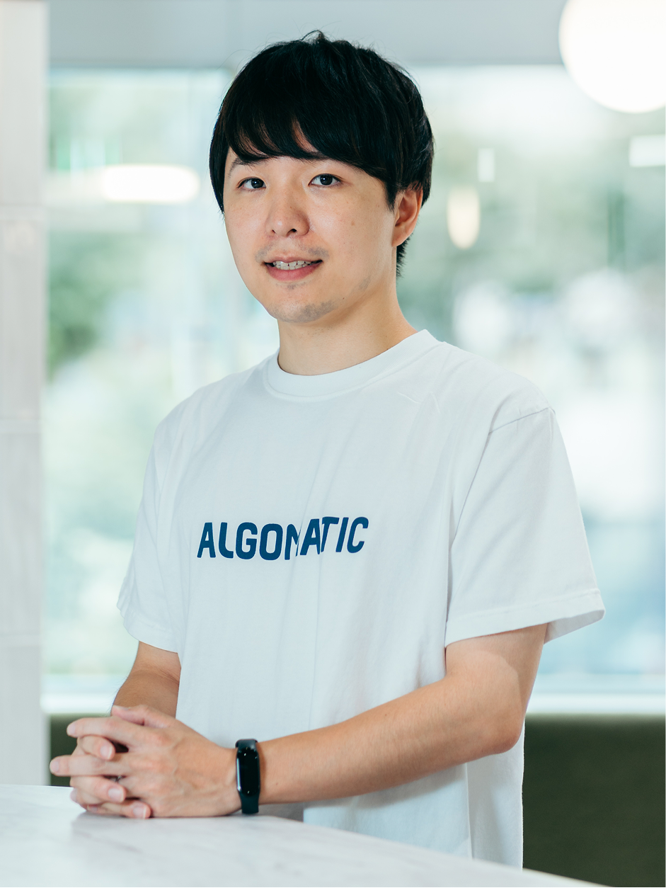

<!-- _header: 'タイポグラフィ' -->

# H1 ABCabc123
## H2 ABCabc123
### H3 ABCabc123
#### H4 ABCabc123
##### H5 ABCabc123
###### H6 ABCabc123

- ABCabc123
    - ABCabc123
- ABCabc123
- ABCabc123

DescriptionDescriptionDescriptionDescriptionDescriptionDescriptionDescriptionDescriptionDescriptionDescriptionDescriptionDescriptionDescriptionDescriptionDescriptionDescriptionDescriptionDescriptionDescriptionDescriptionDescriptionDescriptionDescriptionDescriptionDescriptionDescriptionDescriptionDescriptionDescriptionDescriptionDescriptionDescriptionDescriptionDescriptionDescriptionDescriptionDescriptionDescriptionDescriptionDescriptionDescriptionDescriptionDescriptionDescriptionDescription

---

<!-- _header: 'プロフィール' -->

| 項目 | 内容 |
|-|-|
| 会社名 | 株式会社Algomatic |
| 設立日 | 令和5年4月13日 |
| 代表者 | 代表取締役 CEO 大野 峻典 |
| 主事業 | 大規模言語モデル等生成AI技術を活用した、サービスの開発・提供 |
| 事業所 | 東京都中央区日本橋久松町10-6 THE CROSS日本橋人形町 8F |
| 関係会社 | 合同会社DMM.com / 株式会社Algomatic Works |

---

<!-- _header: '3カラムレイアウト' -->
<!-- _class: three-column -->

# Image with description

### First thing
Add a quick description...

### Second thing
Keep 'em short and sweet...

### Third thing
If you've got a bunch...

---

<!-- _header: 'セクションタイトル' -->
<!-- _class: section-title -->

# Section Title
Quick description about the section.

---

<!-- _header: 'メインレイアウト' -->

## Subtitle
# Header
Add a quick description...

---

<!-- _class: title-slide -->

# 大規模データを扱うクラウドセキュリティプラットフォームのアーキテクチャ変遷
## スケーラビリティとセキュリティの両立を目指して

 

- 代表取締役CEO  
- 大野 峻典

